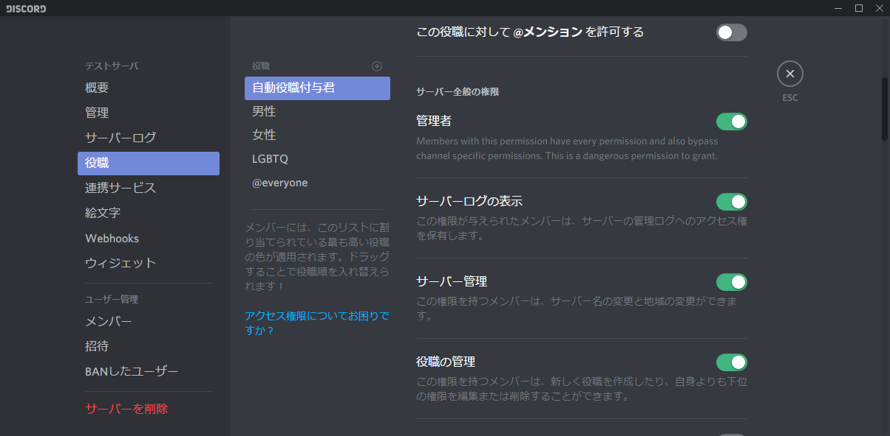

# Readme

## 概要

本リポジトリはDiscordにおいて、プロフィールを書いた際に自動的に性別の役職を振り分けるBotです。

---

## 導入手順書

[BOTのURL](https://discordapp.com/api/oauth2/authorize?client_id=522591422634000384&permissions=268435456&scope=bot)

上記URLより追加してください。

その後、本Botの役職を操作する必要があります。

上記の例に従い、すべての役職よりも上に設定してください。なお、その他Botと干渉する可能性が極めて高いため、Botの優先度を考えて操作する必要があります。

---

### 技術論(備考)

DiscordBotはInt型の数列で、優先度を管理しています。そのため、ヒエラルキーが下位の存在が上位の存在を上回る操作をすることは禁止されています。

従って、上記のような操作が必要になります。